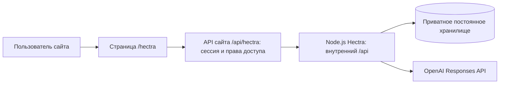

# Hectra: инструкция по интеграции в существующий сайт

> Архивная инструкция поставки. В текущем Silvius интеграция уже выполнена: API подключён в `../server/app.js`, собственный UI пайплайна удалён, актуальные команды находятся в `../README.md`.

Документ для fullstack-разработчика. Описывает текущий код приложения и изменения, которые нужны для подключения к сайту. Стек, домен и система авторизации сайта пока не заданы; примеры используют условный путь `/hectra` для страницы и `/api/hectra` для API.

**Рекомендуемый вариант:** оставить сервер анализа отдельным постоянно работающим Node.js-процессом, подключить его через сервер или reverse proxy сайта, а интерфейс встроить в существующую страницу. Оркестрация, парсеры, проверки, хранение и экспорт уже реализованы.

**Готовность анализа:** программный маршрут проверяется тестовым provider. Все семь системных промптов в поставке намеренно пустые. Для настоящего анализа владелец проекта должен заполнить промпты ролей и настроить ключ OpenAI. Качество live-анализа ещё не проверено.

## 1. Что подключаем



Вызовы OpenAI и доступ к файлам выполняются на сервере Hectra. Браузер получает состояние запуска, реестр результатов, фрагменты источников и экспорт. Фронтенд не управляет последовательностью агентных ролей: её выполняет `Orchestrator`.

| Уже реализовано | Что добавляет интегратор сайта |
| --- | --- |
| Загрузка DOCX, текстовых PDF и XLSX в пулы A/Б | Страница, навигация и оформление сайта |
| Парсинг, версии источников, diff и ссылки на блоки | Сессия пользователя, права на запуск и его файлы |
| Маршрутизация, уточнение, сравнение, judge, исправления, общая проверка и заключение | Привязка запусков к пользователю или рабочему пространству |
| Сохранение и продолжение запуска, ручная проверка, HTML-экспорт | HTTPS-прокси, постоянный диск, запуск процесса и резервное копирование |
| Серверный Responses-клиент, бюджеты и тестовый provider | Настройки окружения; получение промптов от владельца проекта |

### Варианты интерфейса

| Вариант | Объём адаптации |
| --- | --- |
| **Своя страница сайта + существующий API** | Рекомендуется. Использовать примеры ниже; UI можно написать на текущем стеке сайта |
| Готовый интерфейс на отдельном поддомене | Сохранить `public/`, проксировать весь поддомен на Hectra; подключить авторизацию и доступ к запускам |
| Готовый интерфейс внутри `/hectra/` | Адаптировать абсолютные пути ресурсов, API, ссылок и ES-модуля |
| iframe | Сейчас запрещён `Content-Security-Policy: frame-ancestors 'none'`. Потребует отдельной настройки CSP, сессии и разрешённого родительского origin |

Подключать `change_rendering_handoff/workspace.html` не нужно: это исходный комплект редактора со ссылками на отсутствующие части. Рабочая точка входа — `public/index.html`.

## 2. Проверка локального запуска

Требования: Node.js **20.19.0 или новее**, npm. Проверенное окружение текущей сборки — Node.js 20.19.0 / Windows. Отдельного frontend build нет.

Из корня проекта:

```sh
npm ci
npm start
```

Приложение откроется на `http://127.0.0.1:3000`. Команда слушает **только `127.0.0.1`**. Загрузка, извлечение текста, просмотр источников и детерминированный diff доступны без ключа и промптов.

Если локального конфига ещё нет, скопировать `server-config.example.cjs` в `server-config.local.cjs`. Существующий локальный конфиг не перезаписывать.

```powershell
Copy-Item server-config.example.cjs server-config.local.cjs
```

### Настройки сервера

| Настройка | Где задаётся | Поведение |
| --- | --- | --- |
| API-ключ | `OPENAI_API_KEY` или `HARDCODED_OPENAI_API_KEY` в `server-config.local.cjs` | Используется только сервером |
| Общая модель | `OPENAI_MODEL` или поле `model` локального конфига | По умолчанию `gpt-6-astra` |
| Модель отдельной роли | `modelByRole` в локальном конфиге | Необязательное явное переопределение |
| Reasoning | `effortByRole` в локальном конфиге | `low`: routing, extraction, comparison, synthesis; `medium`: crosscheck, judge |
| Fast mode | `serviceTier` в локальном конфиге | По умолчанию `fast` для всех live-запросов Responses API; фактический tier записывается в журнал ответа |
| Параллельное извлечение | `extractionConcurrency` в локальном конфиге | По умолчанию 2 независимых фрагмента одновременно, результаты фиксируются в порядке документов |
| Лимит ответа извлечения | `budgets.extractionOutputTokens` в локальном конфиге | По умолчанию 32 000; при обрыве ответа по лимиту выполняется один повтор с увеличенным пределом |
| Порт | `PORT` | По умолчанию `3000` |
| Каталог данных | `HECTRA_DATA_DIR` | По умолчанию `data/` в корне; на сервере задать абсолютный путь к постоянному диску |
| Тестовый provider | `HECTRA_TEST_MODE=1` | Только для разработки/стенда и запусков с `mode: "test"` |
| Лимиты файлов и бюджет вызовов | `limits`, `budgets` в локальном конфиге | Значения и поля перечислены в шаблоне |

`.env` автоматически не загружается. Передавать окружение через менеджер процесса/контейнер или использовать локальный CJS-конфиг. После изменения ключа, модели или серверных лимитов перезапустить процесс; для новых настроек анализа создать новый запуск.

По умолчанию разрешено **10 файлов на сторону**, **20 МиБ на файл**, **2 млн символов извлечённого текста на запуск**. Размер multipart-запроса немного больше файла. Значения для UI брать из `GET /api/config`, а ограничения уже созданного запуска — из `run.settings.limits`.

### Системные промпты

Все эти файлы поставляются размером **0 байт**:

```text
prompts/system/common.txt
prompts/system/routing.txt
prompts/system/extraction.txt
prompts/system/comparison.txt
prompts/system/crosscheck.txt
prompts/system/judge.txt
prompts/system/synthesis.txt
```

`common.txt` необязателен; остальные шесть файлов нужны для live-анализа. Их содержимое предоставляет владелец проекта. Не добавлять временные инструкции, fallback-промпты или текст задания в другие сообщения модели для обхода этой настройки.

При первом старте анализа, прошедшем preflight, сервер фиксирует снимок промптов и их хеши. Продолжение запуска использует этот снимок. Для применения новых текстов достаточно сохранить файлы и создать новый запуск. API редактирования промптов в приложении нет.

## 3. Подключение API к сайту

### Адреса

В текущем сервере все маршруты начинаются с `/api`. В примерах интеграции:

```text
Страница сайта:          https://site.example/hectra
API для браузера:        https://site.example/api/hectra/runs
Внутренний API Hectra:   http://127.0.0.1:3000/api/runs
```

Сервер сайта или прокси заменяет префикс `/api/hectra/` на `/api/`. Браузер работает с тем же origin, что и сайт. CORS в текущем приложении не настроен. Для разработки можно аналогично настроить proxy dev-сервера.

### HTTPS и проверка Origin

Текущий сервер проверяет `Origin` изменяющих запросов относительно `req.protocol` и `Host`. При завершении HTTPS на прокси Express должен видеть исходный протокол. Иначе обычный POST с сайта может получить `403` с кодом `origin`.

Для nginx и Node на одном хосте можно создать **новый deployment entry point** `server/site-entry.js`:

```js
import { createApplication } from './index.js';

const { app } = await createApplication();
app.set('trust proxy', 'loopback');
app.listen(Number(process.env.PORT || 3000), '127.0.0.1');
```

Это пример адаптации, такого файла в поставке нет. Для него команда запуска — `node server/site-entry.js`; обычный `npm start` по-прежнему запускает `server/index.js`. При другой сети указать адреса доверенных прокси согласно топологии. `trust proxy` влияет на доверие к forwarded-заголовкам; прокси должен сам задавать эти заголовки. [Документация Express](https://expressjs.com/en/guide/behind-proxies/).

Фрагмент nginx внутри уже настроенного HTTPS `server`-блока:

```nginx
location /api/hectra/ {
    proxy_pass http://127.0.0.1:3000/api/;
    proxy_set_header Host $http_host;
    proxy_set_header X-Forwarded-Proto $scheme;
    proxy_set_header X-Forwarded-For $remote_addr;
    client_max_body_size 25m;
    proxy_read_timeout 240s;
    proxy_cache off;
}
```

Завершающий `/api/` в `proxy_pass` задаёт замену префикса. Пример рассчитан на один прокси, непосредственно завершающий HTTPS. [Документация nginx: proxy_pass и заголовки](https://nginx.org/en/docs/http/ngx_http_proxy_module.html#proxy_pass).

`25m` оставляет запас для multipart при лимите файла 20 МиБ; приложение продолжает проверять собственный лимит. Значение согласовать с ограничениями CDN, прокси и сервера сайта. [Документация nginx: client_max_body_size](https://nginx.org/en/docs/http/ngx_http_core_module.html#client_max_body_size).

**Этот фрагмент обеспечивает маршрутизацию. До публикации подключить проверку сессии и прав из раздела 8.** Настройка `trust proxy` не добавляет авторизацию. Длительный анализ работает в фоне; POST `/start` не держит HTTP-соединение до конца анализа. Таймаут загрузки важен отдельно: извлечение файла выполняется до ответа на upload.

В контейнере текущий bind `127.0.0.1` недоступен соседнему контейнеру. Если прокси находится в другом контейнере, в deployment entry point потребуется явный bind `0.0.0.0` внутри закрытой сети. Переменных `HOST`, `BASE_URL` и `APP_BASE` в текущем приложении нет.

## 4. Контракт HTTP API

Ниже указаны **внутренние** пути приложения. Для примера выше заменить `/api` на `/api/hectra`. `:id` — ID запуска; `:doc`, `:finding`, `:task` берутся из его ответа. Стороны в JSON — латинские **`A` и `B`**, подписи в UI — «До изменений» и «После изменений».

### Создание, загрузка и выполнение

| Метод и путь | Вход | Результат / особенности |
| --- | --- | --- |
| `GET /api/config` | — | Модель, effort, `key_ready`, `missing_roles`, `test_mode_available`, лимиты. Ключ не возвращается |
| `GET /api/runs` | — | Список кратких карточек запусков. В текущем коде без фильтра по владельцу |
| `POST /api/runs` | `{name, mode: "live", explicit_pair: false}` | `201`, полный объект запуска. Все три поля необязательны |
| `GET /api/runs/:id` | — | Состояние, документы, задачи, реестр, отчёт. Чтение не запускает анализ |
| `GET /api/runs/:id/preflight` | — | `state`, `missing_roles`, `key_ready`, `test_mode`, `prompt_hashes`; без вызова модели |
| `POST /api/runs/:id/options` | `{explicit_pair?, mode?}` | Настройки до фиксации состава и промптов |
| `POST /api/runs/:id/documents` | multipart: `file`, `side`, необязательное `name` | Один файл на запрос. `201` и `{id, status, warnings}` после парсинга |
| `DELETE /api/runs/:id/documents/:doc` | — | Убрать документ до начала анализа; `{ok: true}` |
| `POST /api/runs/:id/start` | Пустой объект | Запустить/продолжить; возвращает текущее состояние, дальнейшая работа в фоне |
| `POST /api/runs/:id/cancel` | Пустой объект | Остановить и сохранить; не удаляет результаты |
| `POST /api/runs/:id/clarification` | `{answer, skip: false}` или `{skip: true}` | Сохраняет ответ/пропуск и **сам возобновляет** запуск |
| `PUT /api/runs/:id/plan` | Полный объект по `routingSchema`, с текущим `version` | Новая версия плана и инвалидация зависимостей; продолжение отдельным `/start` |
| `POST /api/runs/:id/documents/:doc/reextract` | Пустой объект | Новая версия извлечения того же исходного файла; зависимые результаты устаревают |

`explicit_pair: true` использовать, только когда пользователь явно выбрал одну пару документов A↔Б. Код может пропустить LLM-маршрутизацию этой пары, но сравнение и проверка покрытия остаются обязательными.

### Результаты, источники и ручная проверка

| Метод и путь | Вход | Результат / особенности |
| --- | --- | --- |
| `GET /api/runs/:id/sources/:doc` | Query: `version`, `block` или `offset`, `count` | `{document, blocks, context, next_offset, total}`; `count` по умолчанию 30, максимум 100 |
| `GET /api/runs/:id/originals/:doc` | — | Исходный файл как attachment |
| `GET /api/runs/:id/diff` | Query: `before=<docA>`, `after=<docB>` | `{rows, delta, snapshots}`; детерминированный diff без LLM |
| `GET /api/runs/:id/tasks/:task/diff` | — | Сохранённый diff актуальной задачи; минимум `{rows}` |
| `GET /api/runs/:id/logs` | — | Журнал с вызовами, запросами поиска и результатами инструментов |
| `POST /api/runs/:id/findings/:finding/review` | `{version, decision, text?}` | Обновлённый запуск. Решения: `confirmed`, `rejected`, `edited`, `commented` |
| `POST /api/runs/:id/synthesize` | Пустой объект | Пересобрать текст заключения по текущему реестру; работа в фоне |
| `GET /api/runs/:id/export.html` | — | HTML-отчёт как attachment с понятными источниками и ограничениями |

Есть ещё два маршрута для локального хакатонного стенда: `GET /api/materials` перечисляет DOCX/PDF/XLSX в корне проекта, `POST /api/runs/:id/materials` принимает `{material_id, side}`. На сайте их отключить или ограничить администраторами. Пользовательские загрузки идут через `/documents`.

JSON Schema и перечисления находятся в [shared/contracts.js](shared/contracts.js); фактические обработчики — в [server/index.js](server/index.js). Отдельного OpenAPI-файла и версионированного `/v1` в поставке нет.

### Ошибки и повторы

Обычная ошибка приложения имеет вид:

```json
{"error":"stale_response","message":"Карточка устарела. Обновите страницу.","details":null}
```

Проверять и HTTP-статус, и состояние возвращённого запуска. Многие проверки приложения сейчас отвечают `400`, включая `already_running` и `stale_response`; не рассчитывать исключительно на `409`. Ошибка размера multipart — `413`, Origin — `403`, неизвестный маршрут — `404`. Прокси может вернуть собственную ошибку без JSON.

`POST /start` может успешно вернуть HTTP `200` со `state: "prompts_not_configured"` или `"key_not_configured"`. Это блокировка конфигурации, а не успешный анализ. Поздняя ошибка модели появляется через `GET /runs/:id` в `last_error`, `errors` и состоянии `partial`.

API не поддерживает idempotency key. После сетевого обрыва изменяющего запроса сначала перечитать состояние: автоматический повтор создания или загрузки может создать дубль.

## 5. Пример подключения своей страницы

Ниже обычный браузерный JavaScript; его можно перенести в сервис запросов используемого frontend-фреймворка. Для локального обращения без префикса сайта заменить `API` на `/api`. Если сайт использует CSRF-токен, добавить его получение и заголовок согласно механизму сайта.

```js
const API = '/api/hectra';
const enc = encodeURIComponent;

async function request(path, { method = 'GET', body, signal } = {}) {
  const multipart = body instanceof FormData;
  const headers = new Headers();
  if (body !== undefined && !multipart) {
    headers.set('Content-Type', 'application/json');
  }
  const response = await fetch(API + path, {
    method,
    credentials: 'same-origin',
    cache: 'no-store',
    headers,
    body: body === undefined ? undefined : multipart ? body : JSON.stringify(body),
    signal
  });
  const raw = await response.text();
  let data;
  try { data = JSON.parse(raw); } catch { data = null; }
  if (!response.ok) {
    const error = new Error(data?.message || `Ошибка HTTP ${response.status}`);
    error.code = data?.error || 'http_error';
    error.status = response.status;
    throw error;
  }
  if (data === null) throw new Error('Сервер вернул ответ без ожидаемого JSON');
  return data;
}

async function createAndUpload({ name, beforeFiles, afterFiles }) {
  const run = await request('/runs', {
    method: 'POST',
    body: { name, mode: 'live', explicit_pair: false }
  });
  // Сразу сохранить run.id в состоянии страницы/URL:
  // при ошибке следующего файла уже загруженные документы остаются на сервере.
  for (const [side, files] of [['A', beforeFiles], ['B', afterFiles]]) {
    for (const file of files) {
      const form = new FormData();
      form.set('file', file);
      form.set('name', file.name);
      form.set('side', side);
      const uploaded = await request(`/runs/${enc(run.id)}/documents`, {
        method: 'POST', body: form
      });
      // Передать uploaded.status и uploaded.warnings в карточку файла.
      // status === 'failed' тоже может прийти с HTTP 201.
    }
  }
  return request(`/runs/${enc(run.id)}`);
}

async function startAnalysis(runId) {
  const base = `/runs/${enc(runId)}`;
  const preflight = await request(base + '/preflight');
  if (preflight.state !== 'ready') {
    return { started: false, preflight };
  }
  const run = await request(base + '/start', { method: 'POST', body: {} });
  return { started: run.state === 'running', run };
}

async function watchRun(runId, onUpdate, signal) {
  while (!signal.aborted) {
    const run = await request(`/runs/${enc(runId)}`, { signal });
    onUpdate(run);
    if (run.state !== 'running') return run;
    await new Promise(resolve => setTimeout(resolve, 2500));
  }
}
```

В обработчике страницы создать `AbortController`, передать `controller.signal` в `watchRun`, при уходе вызвать `controller.abort()` и обработать `AbortError`. Остановка polling не останавливает анализ; кнопка «Остановить» отдельно вызывает `/cancel`. Последовательный polling предотвращает перекрытие запросов.

Пример выше показывает транспорт и порядок действий. Отображение ошибок, фиксацию `run.id` сразу после создания, предупреждения файлов и CSRF подключить к компонентам сайта. Не ставить `Content-Type` вручную для `FormData`: браузер добавит multipart boundary.

### Порядок пользовательского сценария

1. Получить `/config`, показать готовность конфигурации и лимиты.
2. Создать запуск; сохранить его ID в URL/состоянии страницы. ID не является доказательством права доступа.
3. Последовательно загрузить файлы каждого пула. Показать `ok`, `partial` или `failed` и предупреждения каждого документа.
4. Дать открыть извлечённый текст и diff. После завершения загрузки вызвать preflight, затем `/start` по действию пользователя.
5. Читать `/runs/:id` примерно раз в 2–3 секунды. Показывать `state`, `stage`, `current_task.label`.
6. При `needs_clarification` показать запись из `run.clarifications` со `status: "pending"`, её `question`, `reason`, `on_skip`.
7. После ответа/пропуска снова следить за запуском. `/clarification` уже вызывает продолжение; повторный `/start` не нужен.
8. Показать актуальный реестр, заключение, ограничения и ручную проверку. Экспорт доступен отдельной ссылкой.

```js
// Ответ на уточнение: не более 12000 символов.
await request(`/runs/${enc(runId)}/clarification`, {
  method: 'POST', body: { answer: clarificationText, skip: false }
});

// Альтернативное действие пользователя — продолжить без ответа.
await request(`/runs/${enc(runId)}/clarification`, {
  method: 'POST', body: { skip: true }
});

// Подтверждение конкретной версии находки.
await request(`/runs/${enc(runId)}/findings/${enc(finding.id)}/review`, {
  method: 'POST', body: { version: finding.version, decision: 'confirmed' }
});

// Содержательное редактирование: создаёт новую версию без старого judge-статуса.
await request(`/runs/${enc(runId)}/findings/${enc(finding.id)}/review`, {
  method: 'POST',
  body: { version: finding.version, decision: 'edited', text: editedClaim }
});
```

Это отдельные примеры действий, а не последовательность для одновременного выполнения. Ответ на уточнение и пропуск — взаимоисключающие операции. После любого изменения использовать свежий объект запуска и версии находок.

## 6. Как отображать результаты

`GET /runs/:id` возвращает больше данных, чем требуется главной странице. Для основных экранов использовать следующие поля:

| Поле | Использование |
| --- | --- |
| `documents` | Состав пулов, имена, качество извлечения, предупреждения и версии |
| `plan` / `registry.plan` | Группы сопоставления документов и диапазонов |
| `registry.findings` | Актуальные находки после исключения устаревших и объединённых версий |
| `registry.function_links`, `registry.org_links` | Соответствия функций и подразделений |
| `registry.functions`, `registry.org_units` | Структурированные записи с доказательствами |
| `registry.coverage.counts` | Счётчики, рассчитанные сервером по ID и журналу |
| `registry.limitations` | Обязательные ограничения для показа рядом с результатом |
| `report` | `overview`, `questions`, `recommendations`, `limitations`, версия и актуальность |
| `tasks` | Актуальные задачи, их статус и число находок; diff читается отдельным маршрутом |
| `evidence` | Исходные цитаты и координаты по ссылкам текущих находок |
| `last_error` | Последняя ошибка выполнения; не скрывать за пустым результатом |

Не строить основную таблицу из `run.findings`: там хранится история. Отклонённые человеком находки могут оставаться в текущем реестре с отдельным `human_status`; показывать их как отклонённые, не включать в подтверждённые выводы.

### Состояния запуска

| `state` | Поведение интерфейса |
| --- | --- |
| `draft` | Загрузка и проверка документов |
| `prompts_not_configured` | «Системные промпты ещё не заполнены»; документы сохранены |
| `key_not_configured` | Не настроен серверный API-ключ |
| `running` | Показывать этап/группу, polling, кнопку остановки |
| `needs_clarification` | Вопрос и две кнопки: отправить или продолжить без пояснения |
| `cancelled`, `interrupted` | Сохранённая незавершённая работа; предложить `/start` |
| `partial` | Незавершённая обработка с причиной; продолжение после устранения причины |
| `completed` | Обработка завершена; отдельно показать статусы находок и границы проверки |
| `completed_with_limits` | Завершено с ограничениями; ограничения видимы сразу |

Стадии: `routing`, `extraction`, `comparison`, `judge`, `crosscheck`, `reconcile`, `synthesis`. Оркестратор может возвращаться к предыдущим стадиям; не вычислять процент готовности только по номеру стадии.

Разделять три независимые характеристики:

- статус выполнения задачи, например `done`;
- `finding.judge_status`: `unreviewed`, `passed`, `needs_revision`, `inconclusive`;
- `finding.human_status`: `unreviewed`, `confirmed`, `rejected`, `edited`.

Подтверждение человеком не превращает результат в `passed`. Значимость (`significance`) и неопределённость (`uncertainty`) также показываются отдельно. Русские подписи уже есть в экспорте `labels` из `shared/contracts.js`.

При `report.stale === true` или несовпадении `report.registry_version` с `registry.version` показать «Заключение требует обновления». Кнопка обновления вызывает `/synthesize`, затем polling. Это обновляет текст по реестру и **не означает новую проверку judge** отредактированной человеком формулировки. При `report.state === "structured_fallback"` показывать структурированный реестр и предупреждение о несостоявшейся текстовой сборке.

### Источники и diff

Ссылка на источник имеет форму:

```json
{
  "document_id": "doc_…",
  "extraction_version": 1,
  "block_id": "b000001",
  "char_start": null,
  "char_end": null
}
```

Всегда передавать `extraction_version`: старый вывод должен открывать проверенную версию текста. Номер пункта и название документа служат подписью, а не идентификатором.

```js
const query = new URLSearchParams({
  version: String(ref.extraction_version), block: ref.block_id, count: '6'
});
const source = await request(
  `/runs/${enc(runId)}/sources/${enc(ref.document_id)}?${query}`
);
// source.context — родительский/соседний контекст;
// source.blocks — выбранные блоки с text и coordinate;
// source.next_offset — продолжение, если текст не закончился.
```

Окно источника показывает название, сторону, версию, координаты, контекст и исходный текст. Использовать `textContent` или штатное экранирование UI-фреймворка. Имена файлов, цитаты и ответы модели не вставлять как HTML.

Строки `diff.rows` содержат собственный `id`, `before_refs[]`, `after_refs[]`, `before_text`, `after_text`, `kind`, `context_changed`, `alignment_method`, `word_diff`. Использовать эту модель для цветной подсветки и переходов к доказательствам. У независимых исходников разные block IDs; сопоставлять их напрямую как секции старого renderer нельзя. Для 1:N и N:M сохранять в UI группы и границы документов. Текстовый diff и смысловая категория находки — отдельные элементы.

### Экспорт

При сессионной авторизации достаточно ссылки на `${API}/runs/${runId}/export.html`; сервер отдаёт attachment. При авторизации заголовком токена скачивать через авторизованный `fetch` и Blob, не помещать токен в URL. Аналогично открывать оригинал через `/originals/:doc`.

Экспорт включает актуальный реестр, статусы, источники и ограничения; устаревшее заключение помечается. HTML формируется и экранируется сервером. Не вставлять скачанный отчёт в DOM сайта через `innerHTML`.

### Изменение карты соответствий

Редактор плана отправляет полный объект `run.plan` по `routingSchema`, сохраняя текущую `version`; сервер сам назначает следующую. Группы содержат диапазоны с `document_id`, `extraction_version`, `start_block_id`, `end_block_id`. Не отправлять только отредактированную группу.

Сначала дождаться остановки выполняющегося запуска, затем сохранить план, перечитать ответ и вызвать `/start`. Инвалидацию зависимостей и наследование бюджета исправлений выполняет сервер. Новые ID задач или групп не должны использоваться для обхода лимита исправлений.

## 7. Если переносим готовый frontend

Рабочие файлы: [public/index.html](public/index.html), [public/app.js](public/app.js), [public/app.css](public/app.css). Статика сервера разрешена только для `/`, `/app.js`, `/app.css`, `/contracts.js`.

При размещении под `/hectra/` нужно:

1. Изменить пути к JS/CSS и главную ссылку в `public/index.html`.
2. Адаптировать импорт `'/contracts.js'` в `public/app.js`.
3. Централизовать базовый путь API вместо разбросанных абсолютных `/api/...`, включая источники, оригиналы и экспорт.
4. Настроить прокси для новых путей ресурсов и API. Проверить обновление страницы по конечному URL.
5. При встраивании DOM в страницу сайта ограничить область действия CSS контейнером Hectra; текущая страница имеет собственные глобальные стили.
6. Ключ `localStorage['hectra-run']` привязать к пользователю/пространству либо перенести ID в URL; очищать указатель при смене пользователя. Данные запуска остаются на сервере.

Одна настройка nginx не исправит абсолютные ссылки внутри готового frontend. Для своей страницы достаточно API из разделов 4–6; подключение старых модальных окон, чата и графа веток не требуется.

## 8. Авторизация и разделение пользовательских данных

Текущая сборка — локальный MVP: **в ней нет сессий, владельцев запусков и разграничения доступа**. Проверка Origin защищает часть сценариев обращения из браузера, но не определяет пользователя. `GET /api/runs` сейчас перечисляет все запуски процесса.

Для сайта выбрать существующую модель доступа: личные запуски или общее рабочее пространство с разрешениями. Затем:

1. Подключить проверку сессии сайта до регистрации API-маршрутов.
2. При создании запуска назначать `owner_id`/`workspace_id` на сервере из проверенной сессии. Клиент не выбирает владельца произвольным JSON.
3. Фильтровать список запусков и проверять доступ при каждом обращении к `:id`, включая источники, оригиналы, diff, журнал и экспорт.
4. Ограничить изменения правом записи; назначать автора ручной проверки/пояснения из сессии. Сейчас поле `author` ручной проверки принимается от клиента, а пояснение получает общее авторство.
5. Явно определить владельца существующих локальных запусков при переносе; не считать их автоматически общедоступными.
6. Подключить механизм CSRF сайта для изменяющих запросов; сохранить проверку Origin с корректной настройкой прокси.
7. Отключить тестовый режим на рабочем окружении, ограничить `/materials`, согласовать квоты запусков и размер хранилища.

**Точка внедрения:** `createApplication()` в `server/index.js` уже регистрирует маршруты и конечный 404-обработчик. Вызов `app.use(authMiddleware)` после `await createApplication()` не защитит существующие обработчики. Добавить middleware внутри фабрики до API-маршрутов либо ввести явный hook фабрики; проверку доступа к загруженному запуску удобно включить в `withRun`. На создание и список нужны отдельные проверки. Это необходимые изменения для сайта, готового auth-hook сейчас нет.

Если всю авторизацию выполняет сервер сайта, Hectra должен быть недоступен в обход него, а сервер сайта обязан проверять права и на чтение, и на изменение каждого запуска. Простой общий логин на reverse proxy оставляет всем вошедшим доступ ко всем запускам.

Ключ, `server-config.local.cjs`, `.env`, промпты и каталог данных не раздавать как static. Текущую раздачу по явному списку сохранить. `logs` содержат фрагменты документов и результаты инструментов; это приватные данные. `run.json` содержит приватный снимок промптов. Полный `publicRun` также включает часть истории и служебных структур; при необходимости ограничить DTO для обычного пользователя на уровне адаптера сайта.

## 9. Развёртывание и сохранность работы

### Один постоянно работающий процесс

Хранилище и блокировки рассчитаны на **один процесс Hectra**. Одновременно выполняется один запуск анализа на весь процесс. Второй `/start` получает `already_running`; очередь разных пользователей пока не реализована. UI должен показать занятость и возможность повторить запуск позже.

Нельзя просто включить несколько replicas/PM2 cluster с общим `HECTRA_DATA_DIR`: состояние и активные задачи находятся также в памяти. Для увеличения параллельности потребуется отдельная доработка хранилища, блокировок и очереди. Аналогично нельзя переносить `Orchestrator` в короткоживущий serverless handler: работа продолжается после HTTP-ответа.

### Постоянный диск

```text
HECTRA_DATA_DIR/
  runs/
    run_<uuid>/
      run.json
      originals/
        doc_<uuid>
  cache/
    <hash>.json
```

Указать постоянный приватный каталог, доступный на запись пользователю процесса. `run.json` сохраняется атомарной заменой файла. Все сохранённые запуски загружаются в память при старте; на большом архиве потребуется пагинация/другая стратегия хранения.

При перезапуске незавершённое `running` становится `interrupted`. Автоматического возобновления нет: пользователь нажимает «Продолжить», вызывается `/start`. GET состояния не создаёт повторных LLM-вызовов. Продолжение сохраняет использованные бюджеты; исчерпанный бюджет не обнуляется.

Для обновления приложения сначала остановить активный анализ и дождаться завершения текущей операции, затем завершить процесс и сделать резервную копию каталога данных. В новой версии сохранить тот же каталог и проверить открытие прежних запусков. Автоматических миграций будущих несовместимых схем нет.

DELETE документа убирает его из состава запуска, но не удаляет исходный файл с диска. API удаления всего запуска и политика очистки архивов/кэша пока отсутствуют. Если сайт обещает удаление данных, реализовать его отдельно с учётом оригиналов, истории, кэша и резервных копий.

### Состав deployment

Сохранить `server/`, `shared/`, `public/`, `prompts/system/`, конфиги/lockfile и зависимости. `server/diff.js` использует `change_rendering_handoff/js/actionLog.js` во время работы — этот ресурс обязателен. Для исходных регрессионных тестов нужен весь `change_rendering_handoff/`. `test-support/` требуется для тестового provider. Контрольные документы не назначаются пользовательским пулам автоматически.

На сервере требуется исходящий HTTPS к OpenAI. Ошибки доступа к модели и неподдерживаемых параметров показываются явно; автоматической подмены `gpt-6-astra` или настроенного уровня reasoning другой конфигурацией нет.

## 10. Проверка интеграции

### Имеющиеся команды

```sh
npm test
npm run test:control
npx playwright install chromium
npm run test:browser
```

`npm test` запускает тесты приложения и исходного комплекта Hectra. `test:control` использует предоставленные контрольные DOCX. Для `test:browser` нужен установленный Chromium Playwright. Тестовые ответы проверяют соединение этапов и обработку ошибок; они не подтверждают качество реального анализа.

Для ручной проверки полного сценария на отдельном стенде:

```powershell
$env:HECTRA_TEST_MODE='1'
$env:HECTRA_DATA_DIR='C:\hectra-test-data'
npm start
```

Создать запуск с `mode: "test"` или выбрать тестовый режим в штатном UI. Каталог в примере заменить на доступный каталог стенда. Сохранять явную маркировку тестового прогона. Для рабочего окружения `HECTRA_TEST_MODE` убрать.

### Приёмка на сайте

- [ ] Страница и ресурсы загружаются через конечный HTTPS-адрес без 404; prefix API работает.
- [ ] POST с того же сайта проходит Origin/CSRF-проверки; неавторизованный запрос отклоняется.
- [ ] Пользователь A не может получить запуск, источники, оригиналы, журнал или экспорт пользователя B, подставив ID.
- [ ] Файлы загружаются последовательно в правильные пулы; лимиты прокси согласованы с приложением.
- [ ] DOCX/PDF/XLSX показывают качество извлечения; повреждённый файл не становится успешным анализом.
- [ ] С пустыми промптами виден `prompts_not_configured`, загруженные документы и diff остаются доступны.
- [ ] В тестовом режиме проходят маршрут, уточнение/пропуск, judge, исправления, общая проверка и сборка; отметка «тестовый прогон» видима.
- [ ] Обновление страницы восстанавливает текущий запуск. Остановка и перезапуск сервера не создают фиктивное завершение.
- [ ] Второй одновременный запуск показывает занятость сервера; нет повторного автоматического POST.
- [ ] Источник открывает нужную версию, исходную цитату и контекст; строки diff ведут к обеим сторонам.
- [ ] Редактирование находки обновляет версию, снимает прежний judge-статус и помечает заключение устаревшим.
- [ ] HTML-экспорт сохраняет ограничения, человеческие решения и понятные источники.
- [ ] Имена и тексты с HTML отображаются как текст; конфиги, промпты и данные не доступны как static.
- [ ] Рабочее окружение использует постоянный диск и выключенный тестовый provider.
- [ ] После получения пользовательских промптов и ключа проведён отдельный live-прогон и проверены его выводы по источникам.

### Частые проблемы

| Симптом | Что проверить |
| --- | --- |
| HTTP 200, анализ не начался | `state`, preflight, список `missing_roles`, наличие ключа |
| POST через HTTPS получает `origin` | Исходный Host, X-Forwarded-Proto и доверие к конкретному прокси |
| JS/CSS/API возвращают 404 под `/hectra/` | Абсолютные пути готового frontend и правила замены префикса |
| Загрузка получает 413 | Ограничения CDN/nginx/сервера сайта и `limits.fileBytes` |
| `already_running` после остановки | Предыдущий вызов может ещё завершаться; перечитать состояние, повторить действие позже |
| `stale_response` при сохранении | Перечитать запуск и предложить пользователю применить изменение к новой версии |
| После deployment исчезли запуски | Значение `HECTRA_DATA_DIR`, постоянный volume, права пользователя процесса |
| После редактирования вывод помечен непроверенным | Это ожидаемо: новая формулировка не наследует старую проверку judge |
| Отчёт есть, но состояние `partial`/`completed_with_limits` | Показать ограничения и незавершённые участки; наличие HTML не означает полноту |

## 11. Файлы для разработчика

| Файл / каталог | Когда менять или читать |
| --- | --- |
| [server/index.js](server/index.js) | API, авторизация, разрешённые static-файлы, proxy-настройки |
| [server/store.js](server/store.js) | Владельцы запусков, сохранение, политика архива/удаления |
| [server/service.js](server/service.js) | Загрузка, повторное извлечение, состав публичного DTO |
| [shared/contracts.js](shared/contracts.js) | Контракты, состояния, схемы ролей и подписи UI |
| [server/orchestrator.js](server/orchestrator.js) | Порядок этапов, возобновление, уточнение и семантические исправления |
| [server/registry.js](server/registry.js) | Версии находок, ручные решения, актуальность заключения |
| [server/export.js](server/export.js) | Состав и экранирование HTML-экспорта |
| [server/config.js](server/config.js), [шаблон конфига](server-config.example.cjs) | Ключ, модель, лимиты, бюджеты |
| [server/prompts.js](server/prompts.js), [server/provider.js](server/provider.js) | Снимок промптов, Responses API, tools, кэш и ошибки |
| [public/app.js](public/app.js) | Пример полностью подключённого UI-сценария |
| [tests/](tests/), [test-support/](test-support/) | Проверки и явно синтетический provider |
| [README.md](README.md) | Подробности локального MVP, извлечения и контрольного кейса |

Практический порядок интеграции: поднять локально → подключить закрытый API за сайтом → добавить владельцев и права → собрать страницу по текущим контрактам → настроить постоянное хранилище и HTTPS → пройти тестовый сценарий → получить пользовательские промпты и провести live-проверку.
